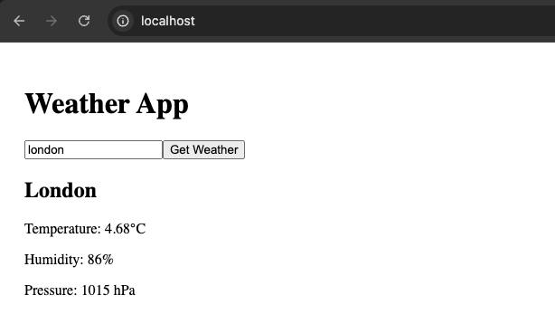
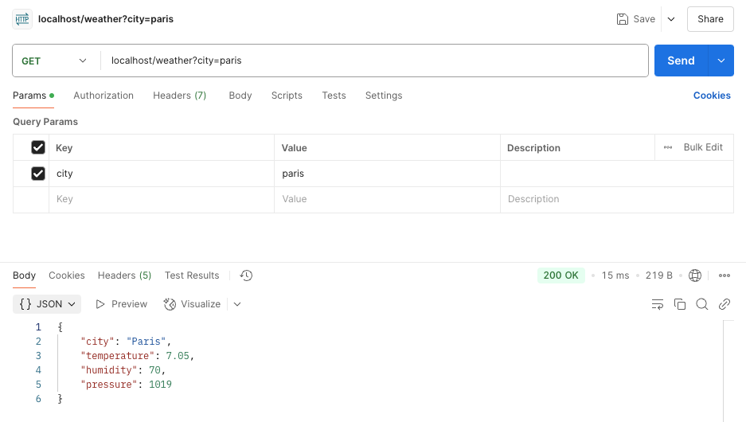
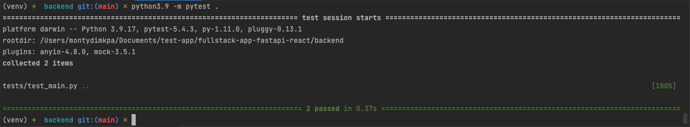
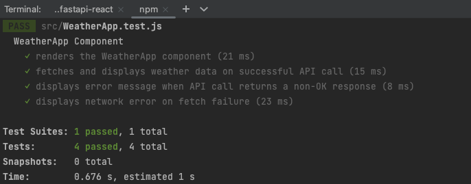

# Weather App

A full‑stack application that fetches and displays current weather data using the OpenWeather API.

This project contains two components:
- **Backend**: A Python FastAPI application that fetches weather data and uses Redis to cache results. We also use NGINX as a reverse proxy to securely and scalably route requests between the frontend and the backend.


- **Frontend**: A React application that allows users to input a city and displays the weather information.

Both components are containerized and run using Docker Compose.

---

## Prerequisites

- [Docker](https://docs.docker.com/get-docker/) and [Docker Compose](https://docs.docker.com/compose/install/) (for containerized deployment)
---

## Setup

1. **Clone the Repository**

   ```bash
   git clone https://github.com/montyd1905/fullstack-app-fastapi-react.git
   cd fullstack-app-fastapi-react

## Configure Environment Variables

You need to create a .env file in the root directory with your OpenWeather API key:

```ini
OPENWEATHER_API_KEY=your_api_key
```

## Running the Application

Use Docker Compose to build and start containers.

From the project root, run:

```bash
docker-compose up --build
```
This command will:

- Build the backend container, running FastAPI on port 80 (internal routing handled by NGINX).


- Build the frontend container, which builds and serves the React app on port 80 (internal routing handled by NGINX).


- Build the Redis and NGINX containers, which help with scalability and request routing between both applications.


## Accessing the application

**Frontend**: Open your browser and navigate to http://localhost



**Backend API**: Access endpoints such as http://localhost/weather?city=London



## Application Security (Reverse Proxy)

We use NGINX as a reverse proxy to handle incoming traffic and route requests to both the frontend and the backend. Although we have not implemented advanced security features like traffic filtering, rate limiting , etc. All of these are possible with NGINX

## Testing
### Backend Testing
Navigate to the backend/ directory.

Ensure dependencies then run the tests using Python and pytest:

```bash
python3 -m pip install -r requirements.txt
python3 -m pytest .
```

The tests in `backend/tests/test_main.py` cover both success and failure scenarios for the weather API endpoint.

Tests passing:



### Frontend Testing
Navigate to the frontend/ directory.

Run the React tests:

```bash
npm test
```

This command runs tests using Jest and React Testing Library to cover key functionality such as fetching data and handling errors.

Tests passing:

